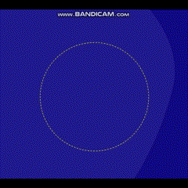
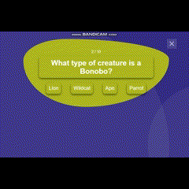
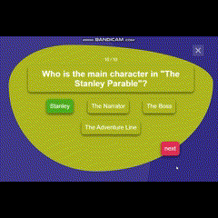

# Let's QUIZZ!
Сайт для любителей викторин и квизов. Вопросы и ответы (на английском языке) получены через сервис Open Trivia API JSON.  
Проект (условно) на стадии MVP: выполняет основную функциональность и обладает минимально необходимым набором функций: вывод вопросов, ответов, проверка ответа (верно/не верно), подсчет и вывод конечного результата.  
Посмотрите [демонтрацию](#how-it-works) или поиграйте сами на сайте: [Let's QUIZZ](/).

## Содержание
- [Структура проекта](#structure)
- [How it works](#how-it-works)
- [To do](#to-do)
- [Технологии, библиотеки и инструменты](#technologies)
- [Использование и разработка](#development)
- [Deployment](#deployment)

## <a id="structure">Структура проекта</a>
    index.html        | Точка входа (entry point) в приложение
    main.js           | Главный модуль (точка входа) для js-файлов, подключенный в index.html через `<script type="module" src="...">`
      style
        style.css           | Каскадная таблица стилей приложения
        normalize.css       | Нормалайзер CSS от Nicolas Gallagher
      assets
        img           | Папка с картинками
      js              | Подключаемые js-модули
        alerts.js           | содержит функции, отвечающие за демонстрацию уведомлений   
                              (об ошибке загрузки данных, о процессе загрузки (ожидание...)
        anime-start-page.js | отвечает за анимацию элемента "Let's Go!" на стартовой странице
        data.js             | отвечает за обращение к API с GET-запросом (методом fetch) 
        modal.js            | содержит и подключает обработчики на элементы открытия и закрытия окна викторины
        quiz.js             | полностью отвечает за логику игры (отображение вопросов и ответов,   переход к следующему вопросу,   
                              проверку ответа, завершение викторины)
        state.js            | "стейт", где хранятся полученные данные (отвечает за подгрузку данных,   перехват ошибки   
                              и вызов функции отображения квиза.
        util.js             | содержит вспомогательные функции (функция декодирования HTML-сущностей типа "&quot;" и замены их строке,   
                              функция перемешивания массивов ответов, функция проверябщая нажатие на клавишу Esc

## How it works
Демонстрация игры:
### Анимация на стартовой странице:
</img>
### Механика игры:
</img>
### Финальный экран, завершение квиза и итоговый результат:
</img>

## To do
- [x] Разработать минимально необходимый функционал: вывод вопросов, ответов, проверка ответа (верно/не верно), подсчет и вывод конечного результата.
- [ ] Добавить возможность выбора уровня сложности (easy/hard/medium).
- [ ] Добавить выбор категорий (тематики), в т.ч. вопросы из области IT.
- [ ] Сохранять прогресс (local storage).

## <a id="technologies">Технологии, библиотеки и инструменты</a>
- JavaScript
- [Vite](https://vitejs.dev/guide/)
- HTML
- CSS
- [animejs](https://animejs.com/)
  
## <a id="development">Разработка</a>
Для установки и запуска проекта Vite требует [Node.js](https://nodejs.org/en/) версии >=12.0.0. 
Для запуска проекта на своем компьютере сделайте форк `fork` и клонируйте репозиторий: `git clone https://github.com/StoneTanya/Quiz.git`  
Перейдите в папку с проектом `cd quiz`
Для установки зависимостей, выполните команду `$ npm install`  
Чтобы запустить сервер для разработки, выполните команду `$ npm run dev`  
Чтобы выполнить production сборку, выполните команду `$ npm run build`  

## Deployment
Посмотреть и поиграть можно в опубликованной версии сайта по [ссылке]().

